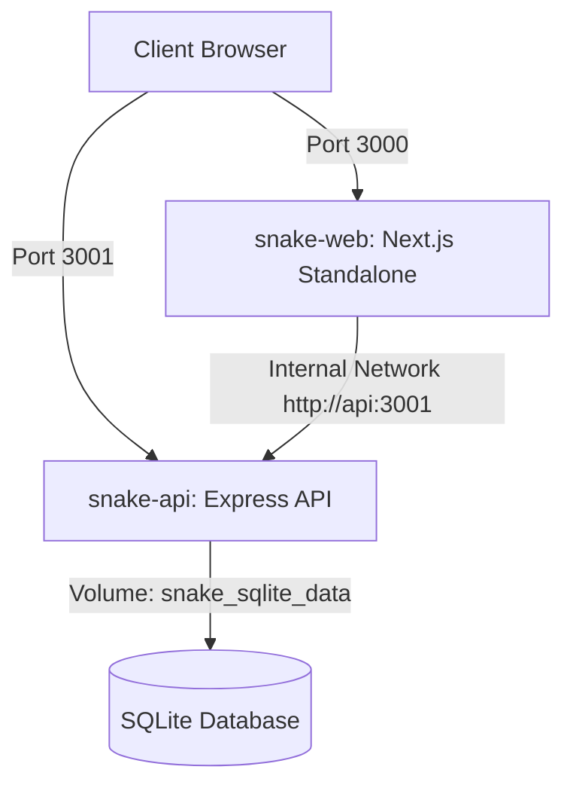

# 🐳 Docker Deployment & Containerization Guide

---

## 1. Overview & Architecture

SnakeMonorepo provides a production-ready, multi-stage Docker setup orchestrated via `docker compose`. It builds and runs both frontend and backend microservices with an isolated bridge network and persistent storage for SQLite.



### Components

| Service | Technology | Port | Image Strategy | Storage |
| :--- | :--- | :--- | :--- | :--- |
| **`api`** | Express + Better Auth + Kysely | `3001` | Multi-stage Node 22 Alpine, unprivileged `expressjs` user | Docker volume `/app/data` |
| **`web`** | Next.js 16 + Tailwind v4 + React 19 | `3000` | Multi-stage Node 22 Alpine, Next.js `standalone` mode | Ephemeral container |
| **`sqlite_data`** | SQLite persistent volume | N/A | Named volume `snake_sqlite_data` | Persists `sqlite.db` |

---

## 2. Quick Start

### Build and Launch All Services

```bash
docker compose up --build -d
```

Once running:
- **Frontend Web App**: [http://localhost:3000](http://localhost:3000)
- **Backend API**: [http://localhost:3001](http://localhost:3001)
- **Demo Admin Account**: `demo@watermelon.ui` / `password123`

---

## 3. Useful Commands

| Action | Command |
| :--- | :--- |
| **View real-time logs** | `docker compose logs -f` |
| **View logs for a single service** | `docker compose logs -f web` or `docker compose logs -f api` |
| **Stop all services** | `docker compose down` |
| **Stop and remove volumes (wipes SQLite data)** | `docker compose down -v` |
| **Rebuild without cache** | `docker compose build --no-cache` |
| **Check container health & status** | `docker compose ps` |

---

## 4. Environment Variables Configuration

You can override defaults by creating a `.env` file in the monorepo root or specifying variables in your host environment:

| Variable | Default Value | Description |
| :--- | :--- | :--- |
| `PORT` (API) | `3001` | Port inside the API container |
| `DATABASE_URL` | `file:/app/data/sqlite.db` | Absolute path to SQLite database inside volume |
| `BETTER_AUTH_SECRET` | *(random demo secret)* | Secret key for Better Auth token encryption (change for production) |
| `BETTER_AUTH_URL` | `http://localhost:3001` | Base URL for Better Auth authentication endpoints |
| `FRONTEND_URL` | `http://localhost:3000` | Allowed CORS origin for client requests |
| `INTERNAL_API_URL` | `http://api:3001` | Server-to-server URL used by Next.js SSR and rewrites |
| `NEXT_PUBLIC_API_URL`| `http://localhost:3001/api` | Public API URL accessed by client browsers |

---

## 5. Next.js Standalone Optimization

The frontend Dockerfile utilizes Next.js **standalone output** (`output: 'standalone'` in `apps/web/next.config.ts`).
- Automatically traces dependencies from workspace root and trims unused `node_modules`.
- Shrinks final production image size from over ~1GB to approximately ~150MB.
- Uses unprivileged `nextjs:nodejs` system user for heightened container security.
